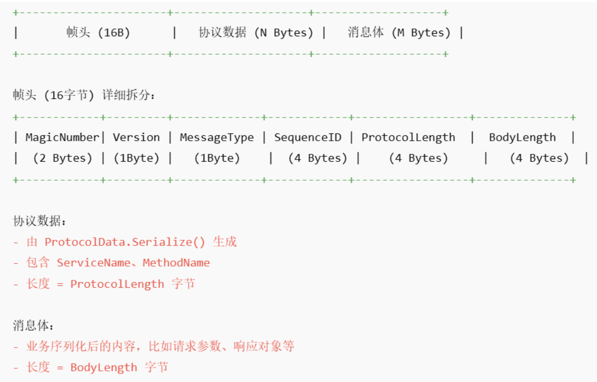
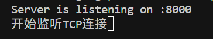

[Version1--基础功能](#Version1)

[Version2--连接池与长连接引入](#Version2)

[Version3--异步调用与多路复用实现](#Version3)

[Version4--gonet网络框架重构+聚集发包](#Version4)
	
# Version1	
希望借助手写这个go的中间件项目，能够理解go语言的特性以及用go写中间件的优势之处，同时也是为了更好的使用和优化公司用到的trpc，并且作者之前也使用过grpc并有一定的兴趣，所以打算从0构建一个rpc系统，对于生产环境已经投入使用的项目抽丝剥茧后，再从0构建，从而更好的理解这个项目和做一个RPC需要注意的地方

打算分为多个版本，从最基本的功能，到逐渐加入新功能和新特性，不断的完善。其中也有一些作者本身的思考优化，其中不足和有误之处还望大家指正


# Server端
rpc首先有多个service，每一个service对应多个方法，当请求到来时再正确路由到对应的方法，通过server端处理后返回client端。所以server端主要做的就是一：注册service和对应的method，二：解析配置文件启动Server， 三：能够正确路由到来的请求并返回client。

## service和Method的注册
grpc和trpc都是使用protobuf作为序列化格式，这里我们的项目也用protobuf格式进行序列化，成熟的rpc项目正常会有对应的工具，我们写好proto文件和对应的service的实现类后，使用自动化构建工具可以生成桩代码，包括以下部分：
1. 消息类（Message Struct）：	把你 .proto 里面定义的请求、响应对象变成对应的语言结构体，比如 UserRequest、UserReply
2. 服务接口（Service Interface）：	把你 .proto 里面定义的方法变成一组接口或基类，供你实现，比如 GetUser(ctx, req)
3. 客户端 Stub	：客户端可以直接用来调用远程方法的代码（自动封装了序列化、网络传输、重试等逻辑），类似于java的动态代理
4. 服务端 Stub	：服务端接收到请求后，自动反序列化，然后回调你实现的业务逻辑，也类似于java的动态代理

这里我们尝试通过一个proto文件，自己实现一个server端的桩代码
```
syntax = "proto3";

package myrpc.helloworld;
option go_package="/pb";

service Greeter {
  rpc Hello (HelloRequest) returns (HelloReply) {}
}

message HelloRequest {
  string msg = 1;
}

message HelloReply {
  string msg = 1;
}
```


第一步，根据填的方法写一个接口：
```go
// 具体方法接口
type HelloServer interface {
	// SayHello is the method that will be called by the client.
	Hello(req *HelloRequest) (*HelloReply, error)
}

```

第二步，我们对每一个方法写一个handler，写实际上的处理逻辑，即如何反序列化，然后回调实际写的业务逻辑，再返回结构体。具体的如何序列化反序列化实现我们后面再看

```go
func HelloServer_Hello_Handler(srv interface{}, req []byte) (interface{}, error) {
	
	// 这里的srv是HelloServer的实现类，我们自己写的
	// 通过类型断言将srv转换为HelloServer类型
	helloServer, ok := srv.(HelloServer)
	if !ok {
		return nil, fmt.Errorf("HelloServer_Hello_Handler: %v", "type assertion failed")
	}
	// 调用HelloServer的Hello方法
	// 将req反序列化
	reqBody := &HelloRequest{}
	err := codec.Unmarshal(req, reqBody)
	if err != nil {
		return nil, fmt.Errorf("HelloServer_Hello_Handler: %v", err)
	}
	// 调用实际我们写的业务逻辑
	reply, err := helloServer.Hello(reqBody)
	
	if err != nil {
		fmt.Printf("HelloServer_Hello_Handler: %v", err)
		return nil, err
	}
	return reply, nil
}
```

第三步，我们写了Handler，当然要让server端能够路由到这个Handler，所以这个Handler需要绑定一个方法名和服务名，作为key保存再server端的一个map里，这样就可以正确路由。所以我们可以写一个方法，将这个映射关系注册到server里。

这个server的Register方法，我们后面再来实现。

```go
// 映射关系
var HelloServer_ServiceDesc = server.ServiceDesc{
		ServiceName: "helloworld",
		HandlerType: (*HelloServer)(nil),
		Methods: []server.MethodDesc{
			{
				MethodName: "Hello",
				// 当接受到客户端调用的Hello方法时，server将会调用这个方法
				Func:    HelloServer_Hello_Handler,
			},
		},
	}

// 绑定方法
func RegisterHelloServer(s *server.Server, svr interface{}) error {
	if err := s.Register(&HelloServer_ServiceDesc, svr); err != nil {
		panic(fmt.Sprintf("Greeter register error:%v", err))
	}
	return nil
}
```

## Server端的启动
Server启动的时候，需要根据我们写的配置文件以得知每一个service的name，以及他们对应的ip和端口号（当然后续还有其他的配置），正常多个service的ip和端口号是一样的，也就是说serve启动的时候，统一暴露一个端口用于rpc调用。
所以server启动的流程是：一：读取配置，二：根据配置名创建多个service并保存
```go
func NewServer() *Server {
	// 1. 创建一个Server实例
	server := &Server{
		services: make(map[string]Service),
	}

	// 2. 读取配置文件
	config, err := loadConfig("./rpc.yaml")
	if err != nil {
		fmt.Print("读取配置文件出错")
	}

	// 3. 创建服务
	for _, svc := range config.Server.Service {
		// 创建服务，这里创建了service实例
		service := NewService(svc.Name, WithAddress(fmt.Sprintf("%s:%d", svc.IP, svc.Port)))

		// 添加到服务映射
		server.services[svc.Name] = service
	}
	return server
}
```

## Service类的实现
前面server端启动的时候创建了所有的service类，这里我们看看具体service应该做什么。

当请求进来时，首先找到service，再找到对应的Method，所以service应该持有method的map，以及在这里实现前面提到的Register逻辑。

同时，每一个service应该有一个serve方法，即提供服务，就是这里开始监听请求，路由和处理，这个后续会详细展开。

我们再为service实现Handler接口，赋予处理业务逻辑的能力，这个接口就是为了路由找到service里的method并调用它，这个Handler详细我们后面再看
```go
// 定义接口，提供一些服务的注册和开启服务的功能
type Service interface {
	// Register registers a service with the server.
	// The serviceName is the name of the service, and service is the implementation of the service.
	Register(serviceDesc *ServiceDesc, service interface{}) error
	// Serve starts the server and listens for incoming connections.
	Serve(address string) error
}
// 定义一个Handler接口，service实现了这个接口
type Handler interface {
	Handle(ctx context.Context, frame []byte) (rsp []byte, err error)
}
	
```

我们先看看比较简单的regsiter方法，虽然registerMethods看起来复杂，但是实际上就是将前面桩代码的Handler作为一个函数存在map里
```go
// 实现service的Register方法，填充service的各个属性
func (s *service) Register(serviceDesc *ServiceDesc, service interface{}) error {

	// 初始化Transport
	s.opts.Transport = transport.DefaultServerTransport

	s.registerMethods(serviceDesc.Methods, service)

	return nil
}

// 注册普通方法
func (s *service) registerMethods(methods []MethodDesc, serviceImpl interface{}) error {
	for _, method := range methods {
		if _, exists := s.handler[method.MethodName]; exists {
			return fmt.Errorf("duplicate method name: %s", method.MethodName)
		}
		s.handler[method.MethodName] = func(req []byte) (rsp interface{}, err error) {
			if fn, ok := method.Func.(func(svr interface{}, req []byte) (rsp interface{}, err error)); ok {
				// 这里调用的就是rpc.go里面的实际的handler方法
				return fn(serviceImpl, req)
			}
			return nil, fmt.Errorf("method.Func is not a valid function")
		}
	}
	return nil
}
```


## Service类的Server方法处理请求

```go
func (s *service) Serve(address string) error {
	fmt.Printf("Server is listening on %s\n", address)

	// 将service作为Handler传入transport，后续接收到请求，会调用service的Handle方法
	s.opts.Transport.RegisterHandler(s)
	err := s.opts.Transport.ListenAndServe(context.Background(), "tcp", address)
	if err != nil {
		return fmt.Errorf("failed to listen: %v", err)
	}
	return nil
}
```
这个Serve方法会在Server端启动的时候，依次触发每一个service类的这个Serve方法，意即为每一个service提供处理请求的能力
这里做了一个serverTransport主要负责网络请求，我们重点关注ListenAndServe
```go
// ListenAndServe 监听并处理 TCP 连接
func (t *serverTransport) ListenAndServe(ctx context.Context, network, address string) error {

	ln, err := net.Listen(network, address)
	if err != nil {
		return fmt.Errorf("failed to listen: %w", err)
	}
	defer ln.Close()

	go func() {
		<-ctx.Done()
		ln.Close()
	}()

	return t.serveTCP(ctx, ln)
}

// serveTCP 处理 TCP 连接
func (t *serverTransport) serveTCP(ctx context.Context, ln net.Listener) error {
	fmt.Print("开始监听TCP连接")
	for {
		conn, err := ln.Accept()
		if err != nil {
			select {
			case <-ctx.Done():
				return nil // 退出监听
			default:
				fmt.Println("accept error:", err)
			}
			continue
		}
		go t.handleConnection(ctx, conn)
	}
}
// handleConnection 处理单个连接
func (t *serverTransport) handleConnection(ctx context.Context, conn net.Conn) {
	//TODO 这里可以做一个处理业务逻辑的协程池
	// 实际上每个连接一个协程，同时负责读取请求并直接处理业务逻辑也是可行的，读取请求时如果阻塞，Go调度器会自动切换到其他协程执行
	// 但是协程池可以限制同时处理业务逻辑的协程数量，避免请求量大时，过多协程导致的资源消耗

	// 这里是处理完一个请求就释放连接，后续可以考虑长连接
	defer conn.Close()
	fmt.Println("New connection from", conn.RemoteAddr())
	// 读取帧
	frame, err := codec.ReadFrame(conn)
	if err != nil {
		fmt.Println("read frame error:", err)
		return
	}
	// 调用service的Handler执行结果
	response, err := t.ConnHandler.Handle(ctx, frame)
	if err != nil {
		fmt.Println("handle error:", err)
		return
	}
	// 发送响应，此时已经是完整帧
	conn.Write(response)
}
```

以上的代码简单来说就是，开启一个coonection，for循环accept请求，一旦请求到达，开启协程进行实际的业务逻辑处理
这个 t.ConnHandler.Handle(ctx, frame)，实际上就是service里的Handler方法，当transport收到请求时，回到我们的service的Handler方法执行。
对于codec.ReadFrame(conn)我们下面重点看看

## Service类的Handler方法
接收到请求，我们的处理过程应该是这样：
1. 接收codec.ReadFrame后得到原始字节流（frame）
2. 解码frame
3. 调用对应的业务方法 handler（其间反序列化）
4. 把业务返回结果序列化
5. 编码生成frame返回给调用方

首先设计**Frame结构**如下：
+----------------------+--------------------+-------------------+
|       帧头 (16B)      |   协议数据 (N Bytes) |   消息体 (M Bytes) |
+----------------------+--------------------+-------------------+

**帧头 (16字节) 详细拆分**：
+------------+---------+-------------+------------+-----------------+--------------+
| MagicNumber| Version | MessageType | SequenceID | ProtocolLength  |  BodyLength  |
|  (2 Bytes)       | (1Byte) |   (1Byte)          |  (4 Bytes)     |    (4 Bytes)         |   (4 Bytes)  |
+------------+---------+-------------+------------+-----------------+--------------+

**协议数据**：
- 由 ProtocolData.Serialize() 生成
- 包含 ServiceName、MethodName
- 长度 = ProtocolLength 字节

**消息体**：
- 业务序列化后的内容，比如请求参数、响应对象等
- 长度 = BodyLength 字节
#### ReadFrame
**即根据帧头读取一段完整的自定义协议数据，解决半包和粘包问题**，先读16字节的帧头解析各字段，校验魔数和版本号，再根据帧头中记录的协议数据长度和消息体长度继续读取剩下的内容，最后把帧头和帧体拼成一个完整的字节数组返回。
```go

func ReadFrame(conn net.Conn) ([]byte, error) {
	buf := bufio.NewReader(conn)
	// 读取帧头
	headerBuf := make([]byte, HeaderLength)
	n, err := io.ReadFull(buf, headerBuf)
	if err != nil {
		return nil, fmt.Errorf("read header error: %v, read %d bytes", err, n)
	}
	// 正确解析所有字段
	header := FrameHeader{
		MagicNumber:    binary.BigEndian.Uint16(headerBuf[0:2]),
		Version:        headerBuf[2],
		MessageType:    headerBuf[3],
		SequenceID:     binary.BigEndian.Uint32(headerBuf[4:8]),
		ProtocolLength: binary.BigEndian.Uint32(headerBuf[8:12]),
		BodyLength:     binary.BigEndian.Uint32(headerBuf[12:16]),
	}
	if header.MagicNumber != MagicNumber {
		return nil, fmt.Errorf("invalid magic number: %d", header.MagicNumber)
	}
	if header.Version != Version {
		return nil, fmt.Errorf("unsupported version: %d", header.Version)
	}
	// 读取协议数据 + 消息体
	frameBody := make([]byte, header.ProtocolLength+header.BodyLength)
	_, err = io.ReadFull(buf, frameBody)
	if err != nil {
		return nil, fmt.Errorf("read body error: %v", err)
	}
	// 拼接完整帧
	frame := append(headerBuf, frameBody...)
	return frame, nil
}

```

#### Decode
读取到Frame后，需要解析出其中的消息体，并将读取到的协议数据存起来
```go
func (c *servercodec) Decode(msg internel.Message, frame []byte) ([]byte, error) {
	// 解析帧头
	header := FrameHeader{
		MagicNumber:    binary.BigEndian.Uint16(frame[0:]),
		Version:        frame[2],
		MessageType:    frame[3],
		SequenceID:     binary.BigEndian.Uint32(frame[4:]),
		ProtocolLength: binary.BigEndian.Uint32(frame[8:]),
		BodyLength:     binary.BigEndian.Uint32(frame[12:]),
	}

	// 验证魔数和版本
	if header.MagicNumber != MagicNumber {
		return nil, fmt.Errorf("invalid magic number: %d", header.MagicNumber)
	}
	if header.Version != Version {
		return nil, fmt.Errorf("unsupported version: %d", header.Version)
	}

	// 提取协议数据
	protocolData := frame[HeaderLength : HeaderLength+header.ProtocolLength]

	// 解析协议数据
	proto, err := DeserializeProtocolData(protocolData)
	if err != nil {
		return nil, fmt.Errorf("parse protocol data error: %v", err)
	}

	// 设置到消息中
	msg.WithServiceName(proto.ServiceName)
	msg.WithMethodName(proto.MethodName)

	// 返回消息体
	return frame[HeaderLength+header.ProtocolLength:], nil
}

```
#### Unmarshal
得到消息体后，还是字节数组，这个时候根据protobuf的格式，反序列化成对应的结构体（这个方法的调用在前面的桩代码的HelloServer_Hello_Handler里）
```go
// Unmarshal 将 protobuf 字节数组反序列化为结构体
func Unmarshal(rspDataBuf []byte, rspBody interface{}) error {
	msg, ok := rspBody.(proto.Message)
	if !ok {
		return fmt.Errorf("Unmarshal: rspBody does not implement proto.Message")
	}
	return proto.Unmarshal(rspDataBuf, msg)
}

```
反序列化后，即可处理业务逻辑，返回的响应的结构仍需要序列化，编码（补充协议数据和帧头），返回客户端，这里就不再详细说明

这里先写server，client下一篇文章再讲


这里我们来实现这个RPC的client端

为了实现RPC的效果，我们调用的Hello方法，即server端的方法，应该是由代理来调用，让proxy里面封装网络请求，消息的发送和接受处理。而上一篇文章提到的服务端的代理已经在.rpc.go文件中实现，我们将客户端的实现也写在这里

# ClientProxy
```go
// 客户端代理接口
type HelloClientProxy interface  {
	Hello(ctx context.Context, in *HelloRequest, opts ...client.Option) (*HelloReply, error)
}


// 客户端代理实现
type HelloClientProxyImpl struct {
	client client.Client
	opts   []client.Option
}

// 创建客户端代理
func NewHelloClientProxy(opts ...client.Option) HelloClientProxy {
	return &HelloClientProxyImpl{
		client: client.DefaultClient,
		opts:   opts,
	}
}

```
- 这里的HelloClientProxyImpl其中的client类主要是负责invoke方法，抽象网络IO和编解码，opts主要是记录客户端启动时传入的配置项，如server的ip地址等
- 创建出客户端代理，我们就可以通过代理来调用Hello方法
```go

// 实现Hello方法
func (c *HelloClientProxyImpl) Hello(ctx context.Context, req *HelloRequest, opts ...client.Option) (*HelloReply, error) {
	// 创建一个msg结构，存储service相关的数据，如serviceName等，并放到context中
	// 用msg结构可以避免在context中太多withValue传递过多的参数
	
	msg := internel.NewMsg()
	msg.WithServiceName("helloworld")
	msg.WithMethodName("Hello")
	ctx = context.WithValue(ctx, internel.ContextMsgKey, msg)
	rsp := &HelloReply{}
	// 这里需要将opts添加前面newProxy时传入的opts
	newOpts := append(c.opts, opts...)
	err := c.client.Invoke(ctx, req, rsp, newOpts...)
	if err != nil {
		return nil, err
	}
	return rsp, nil
}
```
- 这里需要明确service的名字和对应方法，为了后续封装在协议数据里，到达server端才能正确路由。当代理类实现了这个Hello后，我们就可以通过proxy.Hello得到相应结果，Invoke方法隐藏了具体的网络处理，我们跟进Invoke方法


# Client（clientTransPort）
上文提到，client类主要处理invoke方法，我们可以预见它的职责就是，
1. 序列化请求体
2. 编码
3. 发送请求，接受响应
4. 解码
5. 反序列化响应体
6. 返回客户端
为了代码的解耦，我们和server的处理一样，将以上操作放到clientTransPort上，client持有transPort，让transPort处理以上的逻辑
```go

// 实现Send方法
func (c *clientTransport) Send(ctx context.Context, reqBody interface{}, rspBody interface{}, opt *ClientTransportOption) error {
	// 获取连接
	// TODO 这里的连接后续可以优化从连接池获取
	conn, err := net.Dial("tcp", opt.Address)
	if err != nil {
		return err
	}
	defer conn.Close()
	// reqbody序列化
	reqData, err := codec.Marshal(reqBody)
	if err != nil {
		return err
	}
	// reqbody编码，返回请求帧
	framedata, err := opt.Codec.Encode(ctx, reqData)
	if err != nil {
		return err
	}
	// 写数据到连接中
	err = c.tcpWriteFrame(ctx, conn, framedata)
	if err != nil {
		return err
	}
	// 读取tcp帧
	rspDataBuf, err := c.tcpReadFrame(ctx, conn)
	if err != nil {
		return err
	}
	// 获取msg
	ctx, msg := internel.GetMessage(ctx)
	// rspDataBuf解码，提取响应体数据
	rspData, err := opt.Codec.Decode(msg, rspDataBuf)
	if err != nil {
		return err
	}
	// 将rspData反序列化为rspBody
    err = codec.Unmarshal(rspData, rspBody)
	if err != nil {
		return err
	}
	return nil
}
```
- 序列化是根据protobuf协议，编码的格式我们之间写Server的时候提到，我们需要将数据编码成以下格式：

- 当编码完成后，我们就需要写数据到连接中，并监听该连接的数据，当有数据后，我们再依次解码得到响应体，再将响应体反序列化，返回客户端。
- 写数据到连接和读连接中的数据也很简单，这里我们直接开启一个连接，调用Write写，而codec.ReadFrame在server端的时候已经介绍过
```go
func (c *clientTransport) tcpWriteFrame(ctx context.Context, conn net.Conn, frame []byte) error {

	// 写入tcp
	_, err := conn.Write(frame)
	if err != nil {
		return fmt.Errorf("write frame error: %v", err)
	}
	return nil
}

func (c *clientTransport) tcpReadFrame(ctx context.Context, conn net.Conn) ([]byte, error) {
	return codec.ReadFrame(conn)
}
```

# 效果测试
至此client端处理完毕，我们来看看效果：

```go
//client端的测试main.go:
func main() {
	c := pb.NewHelloClientProxy(client.WithTarget("127.0.0.1:8000"))
	if c == nil {
		fmt.Println("Failed to create client")
		return
	}

	rsp, err := c.Hello(context.Background(), &pb.HelloRequest{Msg: "world"})
	if err != nil {
		fmt.Println("RPC call error:", err)
		return
	}
	fmt.Println("Response:", rsp.Msg)
}

// server端的测试的main.go
func main() {
	// Create a new server instance
	s := server.NewServer()

	// Register the HelloService with the server
	pb.RegisterHelloServer(s, &HelloServerImpl{})

	// Start the server on port 50051
	if err := s.Serve(":8000"); err != nil {
		panic(err)
	}

	fmt.Print("启动成功")
}


// 创建一个HelloServer的实现类
type HelloServerImpl struct{}
// 实现HelloServer接口的Hello方法
func (h *HelloServerImpl) Hello(req *pb.HelloRequest) (*pb.HelloReply, error) {
	// 这里可以实现具体的业务逻辑
	reply := &pb.HelloReply{
		Msg: "Hello " + req.Msg,
	}
	return reply, nil
}
```

server端启动：

server端接收到client的连接请求：
![!\[\[Pasted image 20250507223058.png\]\]](images/image3.png)

client收到响应：
![!\[\[Pasted image 20250507223046.png\]\]](images/image2.png)

现在version1开发完了，目前的版本主要是实现基础功能，并且为了考虑后续的扩展性做了比较多的解耦，在后面的版本，我们可以逐渐提升这个rpc的性能和融入更多的功能


在前两个版本中，我们实现了基础的客户端-服务端通信、连接池、序列化等关键模块。为了进一步提升吞吐量和并发性能，本版本新增了 **异步发送机制** 和 **多路复用**支持，旨在减少资源消耗、提升连接利用率。

# Version2
在版本1中，虽然系统能够满足基本需求，但随着连接数的增加和处理请求的复杂度上升，性能瓶颈逐渐显现。为了进一步提升系统的稳定性、并发处理能力以及资源的高效利用，版本2引入了三个重要功能：**客户端连接池、服务器长连接以及服务器处理业务逻辑时引入的协程池，主要是为了更好的利用资源和提高系统的稳定性**。这些功能的引入，使得系统在面对大规模连接和高并发请求时，能够更好地应对。

为了更好的验证两个版本的效果，文章末尾也增加了两个版本的压测效果

# 版本2新增特性
分别解释一下每个功能引入的原因和实际需求。
### 客户端连接池的引入
#### **背景：** 
在之前的版本中，每次与服务器的通信都会创建和销毁连接，频繁的连接创建和销毁不仅浪费了系统资源，每一次都需要经过TCP的握手和挥手，同时也导致了连接响应时间的不稳定，我们希望引入一个连接池，更好的管理和复用连接。
```go
// 原版本
// 实现Send方法
func (c *clientTransport) Send(ctx context.Context, reqBody interface{}, rspBody interface{}, opt *ClientTransportOption) error {
	// 获取连接
	// TODO 这里的连接后续可以优化从连接池获取
	conn, err := net.Dial("tcp", opt.Address)
	if err != nil {
		return err
	}
	defer conn.Close()
```

#### **实现思路：**
连接池和协程池有相似的地方也有不同的地方，首先他们都是池化机制，旨在重用已有资源（连接或协程），避免频繁创建和销毁资源的性能开销。都有空闲资源的回收、最大并发数的限制，以及对请求的排队和等待机制，同时都需要处理资源的生命周期管理（如超时、关闭等）。

但是他们的对象不同，一个是TCP连接，一个是系统的协程。我们可以借鉴协程池的实现来实现这个连接池。

这里还需要注意一个点。我们往往对于一个service的请求是同一目的 IP + 端口（如并发调用多次Hello方法，访问server也是同一个同一目的 IP + 端口，只是源端口不同），不同的方法通过协议数据中的方法名来进行service内的路由。而我们创建的这个连接池，是对于这个目的 IP + 端口的池化处理，针对这个目的 IP + 端口创建多个连接并复用，所以我们系统中对于不同的service应有不同的连接池，故做一个poolManager来统一管理。

**PoolManager**
先来看看这个poolManager，首先是getPoolManager，获取一个全局唯一的poolManager
```go

	type PoolManager struct {
		mu       sync.RWMutex
		pools    map[string]*ConnPool // key是目的ip加端口，v是实际连接池
		ctx      context.Context
		cancel   context.CancelFunc
		sigChan  chan os.Signal
	}

	// GetPoolManager 获取全局唯一的 PoolManager 实例
	func GetPoolManager() *PoolManager {
		poolManagerOnce.Do(func() {
			ctx, cancel := context.WithCancel(context.Background())
			globalPoolManager = &PoolManager{
				pools:    make(map[string]*ConnPool),
				ctx:      ctx,
				cancel:   cancel,
				sigChan:  make(chan os.Signal, 1),
			}
			// 启动信号处理
			go globalPoolManager.handleSignals()
		})
		return globalPoolManager
	}
```
- 首先这个struct持有一个pools，以及sigChan用于监听程序退出时，优雅关闭所有连接池，这个优雅关闭后续再看。
- poolManagerOnce.Do(func() 保证只有一个manager实例
- 我们下面看看如何创建一个连接池
```go
// GetPool 获取指定地址的连接池，如果不存在则创建
func (pm *PoolManager) GetPool(addr string) *ConnPool {
	pm.mu.RLock()
	if pool, exists := pm.pools[addr]; exists {
		pm.mu.RUnlock()
		return pool
	}
	pm.mu.RUnlock()

	// 创建连接池
	pm.mu.Lock()
	defer pm.mu.Unlock()

	// 双重检查，防止其他goroutine已经创建
	if pool, exists := pm.pools[addr]; exists {
		return pool
	}

	pool := NewConnPool(
		addr,           // 服务器地址
		1000,             // 最大活跃连接数
		1000,              // 最小空闲连接数
		60*time.Second, // 空闲连接超时时间
		60*time.Second, // 建立连接最大生命周期
		func(address string) (net.Conn, error) {
			return net.DialTimeout("tcp", address, 60*time.Second)
		},
	)
	pm.pools[addr] = pool
	return pool
}
// handleSignals 处理系统信号
func (pm *PoolManager) handleSignals() {
	// 注册信号
	signal.Notify(pm.sigChan, syscall.SIGINT, syscall.SIGTERM)

	// 等待信号
	sig := <-pm.sigChan
	fmt.Printf("\nReceived signal: %v\n", sig)

	// 创建一个带超时的上下文用于关闭
	shutdownCtx, cancel := context.WithTimeout(context.Background(), 30*time.Second)
	defer cancel()

	// 优雅关闭连接池
	fmt.Println("Shutting down connection pools...")
	if err := pm.Shutdown(shutdownCtx); err != nil {
		fmt.Printf("Error during shutdown: %v\n", err)
	}
	fmt.Println("Connection pools shut down successfully")
}
// Shutdown 优雅关闭所有连接池
func (pm *PoolManager) Shutdown(ctx context.Context) error {
	// 发送关闭信号
	pm.cancel()

	// 等待所有连接池关闭
	done := make(chan struct{})
	go func() {
		pm.mu.Lock()
		for _, pool := range pm.pools {
			pool.Close()
		}
		pm.pools = make(map[string]*ConnPool)
		pm.mu.Unlock()
		close(done)
	}()

	// 等待关闭完成或超时
	select {
	case <-done:
		return nil
	case <-ctx.Done():
		return ctx.Err()
	}
}
```
- GetPool中，先获取读锁判断是否有pool已经创建，若没有获取写锁创建连接池
- handleSignals是创建manager时创建的一个协程监听系统信号，如果进程结束，则调用Shutdown，关闭所有的pool。

**ConnectPool**
获得了连接池后，我们看看如何获取连接，即**get操作**
```go

func (p *ConnPool) Get() (net.Conn, error) {
	p.mu.Lock()
	defer p.mu.Unlock()

	// 如果连接池已关闭或正在关闭，拒绝新连接
	if p.closed || p.closing {
		return nil, ErrPoolClosed
	}

	// 设置等待超时
	var startWait time.Time
	if p.maxWait > 0 {
		startWait = time.Now()
	}

	for {
		// 检查空闲连接
		if len(p.idleConns) > 0 {
			conn := p.idleConns[len(p.idleConns)-1]
			p.idleConns = p.idleConns[:len(p.idleConns)-1]
			atomic.AddUint64(&p.stats.Hits, 1)

			// 连接健康检查
			if !p.isHealthy(conn) {
				conn.conn.Close()
				atomic.AddInt32(&p.activeCount, -1)
				continue
			}

			// 重置超时设置
			conn.conn.SetDeadline(time.Time{})
			conn.conn.SetReadDeadline(time.Time{})
			conn.conn.SetWriteDeadline(time.Time{})

			conn.lastUsed = time.Now()
			atomic.AddInt32(&p.activeCount, 1)
			p.wg.Add(1)
			p.mu.Unlock()
			return &pooledConnWrapper{conn, p}, nil
		}

		// 检查是否可以创建新连接
		if int(atomic.LoadInt32(&p.activeCount)) < p.maxActive {
			atomic.AddInt32(&p.activeCount, 1)
			p.wg.Add(1)
			atomic.AddUint64(&p.stats.Misses, 1)
			p.mu.Unlock()

			conn, err := p.dialFunc(p.addr)
			if err != nil {
				atomic.AddInt32(&p.activeCount, -1)
				p.wg.Done()
				atomic.AddUint64(&p.stats.Errors, 1)
				p.cond.Signal()
				return nil, err
			}

			pooledConn := &PooledConn{
				conn:      conn,
				createdAt: time.Now(),
				lastUsed:  time.Now(),
			}
			return &pooledConnWrapper{pooledConn, p}, nil
		}

		// 等待连接释放
		if p.maxWait > 0 {
			atomic.AddUint64(&p.stats.Timeouts, 1)
			p.cond.Wait()

			// 检查是否超时
			if time.Since(startWait) >= p.maxWait {
				p.mu.Unlock()
				return nil, fmt.Errorf("连接池获取连接超时，等待时间: %v", time.Since(startWait))
			}
		} else {
			p.cond.Wait()
		}
	}
}

```
- 连接池的各个连接有两种状态，空闲连接，活跃连接（正在处理IO的连接），空闲连接通过Put方法归还连接，若超过最大空闲连接数，则该连接被close，活跃连接通过Get方法将其置为活跃状态，若超过最大活跃连接数，则需要排队等待连接池释放连接
- 获取到连接有几种可能，一种是有空闲连接直接获取返回，一种是无空闲连接，但是活跃连接数未达到最大阈值，则创建新连接，一种是无空闲连接且达到了最大活跃连接数，则通过cond.Wait等待，直到被唤醒的时候，在通过上面几种方式尝试获取
- 同样有三种情况无法调用get的时候立即创建新连接，一个就是连接池正在关闭或者已经关闭，一个是获取的空闲连接健康检测不通过（这里的检测就是简单的调用conn.Read读，如果读到数据或者返回err则说明不健康，这个连接仍在被使用），还有一个就是无空闲连接且达到了最大活跃连接数，cond.wait等待的时间超过了最大等待时间
- 接下来看看**Put方法**

```go

func (p *ConnPool) Put(conn net.Conn) {
	pc, ok := conn.(*pooledConnWrapper)
	if !ok {
		conn.Close()
		return
	}

	p.mu.Lock()
	defer p.mu.Unlock()

	// 减少活跃计数
	atomic.AddInt32(&p.activeCount, -1)
	p.wg.Done()

	// 如果连接池正在关闭或已关闭，直接关闭连接
	if p.closing || p.closed {
		pc.conn.conn.Close()
		p.cond.Signal()
		return
	}

	// 检查连接是否健康
	if !p.isHealthy(pc.conn) {
		pc.conn.conn.Close()
		p.cond.Signal()
		return
	}

	// 检查是否超过最大空闲连接数
	if len(p.idleConns) >= p.maxIdle {
		pc.conn.conn.Close()
		p.cond.Signal()
		return
	}

	pc.conn.lastUsed = time.Now()
	p.idleConns = append(p.idleConns, pc.conn)
	p.cond.Signal()
}
```
- Put方法较为简单，当客户端处理完请求的时候，就 defer一下pool的Put方法归还连接，将该连接的状态置为空闲，如果超过了最大空闲数则close这个连接
- 最后看看close方法，连接池的优雅关闭
```go
func (p *ConnPool) Shutdown(timeout time.Duration) error {
	p.mu.Lock()
	// 标记为正在关闭，不再接受新连接
	p.closing = true
	p.mu.Unlock()

	// 关闭所有空闲连接
	p.mu.Lock()
	for _, conn := range p.idleConns {
		conn.conn.Close()
	}
	p.idleConns = nil
	p.mu.Unlock()

	// 等待活跃连接完成或超时
	done := make(chan struct{})
	go func() {
		p.wg.Wait() // 等待所有活跃连接归还
		close(done)
	}()

	select {
	case <-done:
		// 所有活跃连接已完成
		p.mu.Lock()
		p.closed = true
		p.mu.Unlock()
		return nil
	case <-time.After(timeout):
		// 超时，强制关闭
		p.mu.Lock()
		p.closed = true
		p.mu.Unlock()
		return fmt.Errorf("连接池关闭超时，仍有 %d 个活跃连接", atomic.LoadInt32(&p.activeCount))
	}
}

func (p *ConnPool) Close() {
	// 默认给5秒超时
	if err := p.Shutdown(5 * time.Second); err != nil {
		fmt.Println("连接池关闭警告:", err)
	}
}


```
- 首先**为什么需要优雅关闭**？ 如果没有任何协程监听信号（无 signal.Notify）当 SIGINT（Ctrl+C）或 SIGTERM（kill）发生时，进程会立即退出，所有协程（包括 main 和子协程）会被强制终止。操作系统回收所有资源包括socket连接，这就意味着所有未完成的 net.Conn 会被强制关闭，服务端会收到 RST（强制关闭连接，不进行四次挥手） 而非 FIN。**我们希望这些正在进行的连接能够正常处理完再关闭**，避免server收到不完整的数据从而引发其他意外发生
- 当然我们需要为这个等待活跃连接处理完设置一个超时时间，所以再Close中，调用shutdown方法并设置了5秒超时时间，shutdown中关闭所有空闲连接，并wg.wait等待活跃连接处理完毕

至此客户端的连接池做好了，但是需要考虑的是，版本1的server端的连接是一次性的，处理完业务逻辑返回后立即close连接。如果不改server的短连接为长连接，那么客户端的连接池则没有意义，即使是空闲的连接仍然会被server立即close掉，所以我们引入server端的长连接

### 服务器长连接的引入
#### **背景：** 
在旧版本中，客户端与服务器之间的每次请求都需要进行连接和断开，频繁的建立和关闭连接增加了系统的负担。长连接机制能够让服务器保持与客户端的连接，在连接周期内不断发送和接收数据，减少了连接频繁创建的开销，提高了通信效率，尤其是在需要频繁请求的场景下。

#### **技术思路：**

使用for循环监听长连接，不断读取请求帧，并根据上下文状态决定是否关闭连接。同时使用超时机制来防止长时间未操作的连接占用资源。主要更改handleConnection这个方法，即listen到新连接后，go出去的一个协程处理这个方法
```go

// handleConnection 处理单个连接
func (t *serverTransport) handleConnection(ctx context.Context, conn net.Conn) {
	// 设置连接超时
	idleTimeout := 30 * time.Second
	if t.opts != nil && t.opts.IdleTimeout > 0 {
		idleTimeout = t.opts.IdleTimeout
	}

	// 设置读取超时
	conn.SetReadDeadline(time.Now().Add(idleTimeout))

	// 处理连接
	fmt.Printf("New connection from %s\n", conn.RemoteAddr())

	// 循环读取请求，即长连接
	for {
		select {
		// 1. 如果上下文被取消，则关闭连接
		case <-ctx.Done():
			fmt.Printf("Context cancelled, closing connection from %s\n", conn.RemoteAddr())
			return
		default:
			frame, err := codec.ReadFrame(conn)
			if err != nil {
				// 2. 如果读取帧失败，如客户端断开连接，则关闭连接
				if err == io.EOF {
					fmt.Printf("Client %s disconnected normally\n", conn.RemoteAddr())
					return
				}
				// 3. 如果连接超时，超过设置的idletime，关闭连接
				if e, ok := err.(net.Error); ok && e.Timeout() {
					fmt.Printf("Connection from %s timed out after %v\n", conn.RemoteAddr(), idleTimeout)
					return
				}
				// 4. 处理强制关闭的情况
				if strings.Contains(err.Error(), "forcibly closed") {
					fmt.Printf("Client %s forcibly closed the connection\n", conn.RemoteAddr())
					return
				}
				fmt.Printf("Read error from %s: %v\n", conn.RemoteAddr(), err)
				return
			}

			// 重置读取超时
			conn.SetReadDeadline(time.Now().Add(idleTimeout))

			// 使用协程池处理请求
			frameCopy := frame // 创建副本避免闭包问题
			err = t.pool.Submit(func() {
				// 处理请求
				response, err := t.ConnHandler.Handle(context.Background(), frameCopy)
				if err != nil {
					fmt.Printf("Handle error for %s: %v\n", conn.RemoteAddr(), err)
					return
				}

				// 发送响应
				if _, err := conn.Write(response); err != nil {
					fmt.Printf("Write response error for %s: %v\n", conn.RemoteAddr(), err)
				}
			})

			if err != nil {
				fmt.Printf("Submit task to pool error for %s: %v\n", conn.RemoteAddr(), err)
				// 协程池提交失败，直接处理
				response, err := t.ConnHandler.Handle(ctx, frame)
				if err != nil {
					fmt.Printf("Handle error for %s: %v\n", conn.RemoteAddr(), err)
					continue
				}

				if _, err := conn.Write(response); err != nil {
					fmt.Printf("Write response error for %s: %v\n", conn.RemoteAddr(), err)
					return
				}
			}
		}
	}
}

```
- 可见现在处理读取帧的逻辑变成了for循环，即长连接处理多次的请求，当遇到客户端连接断开或者长时间没有数据传输，则server关闭这个连接


### 服务端协程池的引入
#### **背景：** 
在之前的版本中，服务器需要为每一个请求分配一个独立的协程处理，随着请求量的增加，创建大量的协程会导致资源浪费和上下文切换的开销。 通过引入协程池，可以限制并发协程的数量，避免系统因为过多的协程而出现性能瓶颈。协程池帮助复用已有的协程，减少了每个请求创建新协程的开销，提升了处理能力。

#### **技术思路：**

使用一个协程池管理并发任务，限制并发请求的数量。如果协程池中的协程数量已达到上限，新请求将被等待或者直接失败，避免过度的并发资源竞争。这里主要还是handleConnection这个方法
```go
// handleConnection部分代码
// 使用协程池处理请求
			frameCopy := frame // 创建副本避免闭包问题
			err = t.pool.Submit(func() {
				// 处理请求
				response, err := t.ConnHandler.Handle(context.Background(), frameCopy)
				if err != nil {
					fmt.Printf("Handle error for %s: %v\n", conn.RemoteAddr(), err)
					return
				}

				// 发送响应
				if _, err := conn.Write(response); err != nil {
					fmt.Printf("Write response error for %s: %v\n", conn.RemoteAddr(), err)
				}
			})
```
- 这里使用了t.pool.Submit(func() 来把业务处理逻辑交由协程池，这里协程池用的是"github.com/panjf2000/ants/v2" 里的ants.Pool
- 其实这里想和netty的多路复用模型做一个比对，可以更好的理解这种go的模型：

1. **Go 的 `net` 包**：
   - 全局 netpoller 管理所有 socket（监听 + 连接）。实际上go的事件循环包括监听和连接事件，也就是epoll监听的事件循环中，包括**监听连接事件**（就绪则创建连接），和**处理连接事件**（就绪则读请求，这个事件是在我们**调用conn.Read的时候注册到事件循环中**，协程进入等待状态，当数据到达内核的时候则事件就绪，go的调度器会唤醒这个协程开始read数据），实际上和**redis的单reactor单线程有点像**
   - 但是这里处理业务逻辑就不是单线程了， 我们这里用了协程池来处理业务逻辑
1. **Netty**：
   - 主 Reactor 负责 `Accept`，从 Reactor 负责 `Read`/`Write`。相对于go的模型做了职责的分类，处理业务逻辑同样是线程池来做，**主从reactor多线程模型**
![!\[\[Pasted image 20250510184039.png\]\]](images/image4.png)

# 压测
进行了以上的改进，我们试着写一个例子进行压测，和版本1进行比对
```go
package main

import (
	"MyRPC/core/client"
	"MyRPC/pb"
	"context"
	"fmt"
	"net/http"
	_ "net/http/pprof"
	"runtime"
	"sync"
	"sync/atomic"
	"time"
)

var (
	success int64
	wg      sync.WaitGroup
)

func main() {
	// 启动 pprof 服务（用于可视化内存分析）
	go func() {
		fmt.Println("[pprof] listening on :6060")
		_ = http.ListenAndServe(":6060", nil)
	}()

	// 创建 RPC 客户端
	c := pb.NewHelloClientProxy(client.WithTarget("121.40.244.59:8001"))
	if c == nil {
		fmt.Println("Failed to create client")
		return
	}

	printMemStats("Before requests")
	// 20000并发
	// 客户端连接池是1000最大活跃连接数，1000最小空闲连接数
	const N = 20000
	start := time.Now()
	for i := 0; i < N; i++ {
		wg.Add(1)
		go func(i int) {
			defer wg.Done()
			rsp, err := c.Hello(context.Background(), &pb.HelloRequest{Msg: "world"})
			if err == nil && rsp != nil {
				atomic.AddInt64(&success, 1)
			} else {
				fmt.Printf("Request %d error: %v\n", i, err)
			}
		}(i)
	}
	wg.Wait()
	elapsed := time.Since(start)
	printMemStats("After requests")

	fmt.Println("\n------ Benchmark Summary ------")
	fmt.Printf("Total requests: %d\n", N)
	fmt.Printf("Success count:  %d\n", success)
	fmt.Printf("Total time:     %v\n", elapsed)
	fmt.Printf("Avg per call:   %v\n", elapsed/time.Duration(N))

	// 休眠3s
	time.Sleep(3 * time.Second)
}

// 打印内存状态
func printMemStats(label string) {
	var m runtime.MemStats
	runtime.ReadMemStats(&m)
	fmt.Printf("\n=== %s ===\n", label)
	fmt.Printf("Alloc = %v KB\n", m.Alloc/1024)
	fmt.Printf("TotalAlloc = %v KB\n", m.TotalAlloc/1024)
	fmt.Printf("Sys = %v KB\n", m.Sys/1024)
	fmt.Printf("NumGC = %v\n", m.NumGC)
}
```

对于4核8GCPU的压测结果如下：
![!\[\[Pasted image 20250510184147.png\]\]](images/image5.png)
同样对于10000并发和30000并发，平均处理时间都在2至4ms左右，
而对于版本一，当并发量到达万级别时，已经处理不完了......笔者等了好长时间也没等到结果，tcp连接已经达到了机器极限，太多时间阻塞在连接的关闭和建立上

# 总结
该版本实际上与http1.1的特性有相似之处，同样是支持了长连接，但是同样会存在队头阻塞的情况，虽然是复用同一 TCP 连接发送多个请求，但是请求对于一个TCP的连接连接仍然是串行，必须等上一个请求完成，如果上一个请求耗时长就会阻塞了。所以后续版本可以考虑引入http2的多路复用的特性。同时也可以考虑实现rpc的异步发送和流式传输


# Version3
# 版本三新增特性
### 异步发送机制实现
**背景：**
在同步RPC调用中，客户端每发送一次请求都需阻塞等待响应，这在网络抖动或响应较慢时会严重降低系统吞吐量。因此，本版本引入了 异步任务模型，支持**超时重试、指数退避、完成回调**等能力，确保在客户端请求失败后可以自动重试、不中断主逻辑。

**实现思路：**
实际上异步回调的功能很好实现，只需要将回调方法传入内部，当内部状态为成功或者完成的时候调用该callback方法即可。
而异步超时失败重试的机制实际上是让客户端的发送请求交由另一个协程来做，客户端可以先执行其他的逻辑再阻塞等待future的结果，或者设置一个回调方法，或者不关心回复。异步发送实际上就是牺牲了可靠性，而重试是为了尽量提高这个可靠性。超时重试这个可以通过在协程内通过计时器重试，如果超时则在同一个协程中再进行一次发送，直到重试到大于最大重试次数。但是这样会导致等待重试的协程数量太多，对于某一时间段网络出现抖动的情况，出现了大量的重试，就会导致协程数剧增的情况。
借鉴了RocketMQ的异步发送的机制，采用了一个协程统一管理需要重试的任务，并用一个延时队列来排序处理任务

**Client的变动**
为了区分同步发送，为异步增加了异步的proxy和异步的send方法
```go
// 创建客户端代理
func NewHelloAsyncClientProxy(opts ...client.Option) HelloAsyncClientProxy {
	return &HelloAsyncClientProxyImpl{
		client: client.DefaultClient,
		opts:   opts,
	}
}
// 实现HelloAsync方法
func (c *HelloAsyncClientProxyImpl) HelloAsync(ctx context.Context, req *HelloRequest, opts ...client.Option) (*internel.Future, *common.RPCError) {
	msg := internel.NewMsg()
	msg.WithServiceName("helloworld")
	msg.WithMethodName("Hello")
	ctx = context.WithValue(ctx, internel.ContextMsgKey, msg)

	rsp := &HelloReply{}
	// 这里需要将opts添加前面newProxy时传入的opts
	newOpts := append(c.opts, opts...)
	return c.client.InvokeAsync(ctx, req, rsp, newOpts...)
}
```
- 这里是rpc.go中新增的代理以及实现方法，还没有体现异步发送的逻辑，接下来看InvokeAsync

**InvokeAsync**
```go
func (c *client) InvokeAsync(ctx context.Context, reqBody interface{}, rspBody interface{}, opt ...Option) (*internel.Future, *common.RPCError) {
	future := internel.NewFuture()
	opts := DefaultOptions
	for _, o := range opt {
		o(opts)
	}

	go func() {
		var task *async.Task
		if opts.Timeout > 0 {
			// 有超时时间的情况下，无论是否进行重试，将任务提交给全局管理器
			ctx, msg := internel.GetMessage(ctx)
			task = &async.Task{
				MethodName:  msg.GetMethodName(),
				Request:     reqBody,
				MaxRetries:  opts.RetryTimes,
				Timeout:     opts.Timeout,
				ExecuteFunc: c.makeRetryFunc(ctx, reqBody, rspBody, opts),
				OnComplete: func(err error) {
					// 最终结果回调到原始Future
					if err != nil {
						future.SetResult(nil, &common.RPCError{
							Code:    common.ErrCodeRetryFailed,
							Message: err.Error(),
						})
					} else {
						future.SetResult(rspBody, nil)
					}
				},
			}
			// 提交任务到全局管理器
			task.Status = async.TaskStatusPending
			future.Task = task
			async.GetGlobalTaskManager().AddTask(task)
			// 执行发送逻辑
			err := opts.ClientTransport.Send(ctx, reqBody, rspBody, opts.ClientTransportOption)
			if err == nil {
				future.SetResult(rspBody, nil)
			}
		} else {
			// 无超时时间的情况下，错误的话直接返回
			err := opts.ClientTransport.Send(ctx, reqBody, rspBody, opts.ClientTransportOption)
			if err == nil {
				future.SetResult(rspBody, nil)
			} else {
				future.SetResult(nil, &common.RPCError{
					Code:    common.ErrCodeClient,
					Message: err.Error(),
				})
			}
		}
	}()
	return future, nil
}
```
- 我们先看看Future结构，再去理解上面的代码：
```go
	type Future struct {
		mu        sync.Mutex
		done      chan struct{}
		result    interface{}
		err       *common.RPCError
		callbacks []func(interface{}, *common.RPCError)
		Task      *async.Task // 关联的异步任务
	}
		// SetResult 设置Future的结果
	func (f *Future) SetResult(result interface{}, err *common.RPCError) {
		f.mu.Lock()
		defer f.mu.Unlock()

		if f.isDone() {
			return
		}

		f.result = result
		f.Task.Status = async.TaskStatusCompleted
		f.err = err
		close(f.done)

		// 执行所有注册的回调
		for _, callback := range f.callbacks {
			callback(result, err)
		}
	}
```
- 这个就是异步发送后返回的Future，result就是回包结果，callbacks就是客户端设置的回调方法，Task是后续添加到全局异步管理器的任务，后续再说
- 而这个SetResult就是在得到结果后设置future的result，并且调用所有注册的回调方法，并置Task.Status = async.TaskStatusCompleted，这个关于task的我们后面再说
- 接下来回到invokeAsync，对于没有设置超时时间的发送，我们直接在失败后返回客户端（客户端能够忍受异步的丢失，如果真的发生了长时间的阻塞，也不用担心这个协程不释放，因为我们的连接池会管理这个连接的生命周期），对于设置了超时时间的发送，我们需要在超时时间到达后进行重试，或者达到最大重试次数后进行失败反馈
- 这里就做了一个全局的管理器，先创建一个Task将其添加到manager中，再进行消息的正常发送。

**TaskManager**
```go
// Task 表示一个异步任务
type Task struct {
	MethodName  string             // 方法名
	Request      interface{}        // 请求参数
	RetryTimes   int                // 当前已重试次数
	MaxRetries   int                // 最大重试次数
	Timeout      time.Duration      // 单次任务超时时间
	NextRetryAt  time.Time         // 下次重试时间（用于堆排序）
	ExecuteFunc  func() error       // 重试时任务执行函数
	Status       TaskStatus        // 状态字段
	OnComplete   func(error)       // 最终完成回调
	mu           sync.Mutex // 保证状态变更的线程安全
}


// 扫描循环（核心逻辑）
func (tm *TaskManager) scanLoop() {
	for {
		select {
		case <-tm.closeChan:
			return
		default:
			tm.processTasks()
		}
	}
}

// 处理超时任务
func (tm *TaskManager) processTasks() {
	tm.mu.Lock()
	if tm.tasks.Len() == 0 {
		tm.mu.Unlock()
		// 无任务时休眠，直到被唤醒
		select {
		case <-tm.wakeChan:
		case <-time.After(10 * time.Second): // 防止长期阻塞
		}
		return
	}

	// 检查堆顶任务是否超时
	now := time.Now()
	task := (*tm.tasks)[0]
	if now.Before(task.NextRetryAt) {
		// 未超时，休眠到最近任务到期
		tm.mu.Unlock()
		time.Sleep(task.NextRetryAt.Sub(now))
		return
	}

	// 弹出超时任务
	task = heap.Pop(tm.tasks).(*Task)
	tm.mu.Unlock()

	// 执行重试逻辑
	go tm.retryTask(task)
}

// 重试任务
func (tm *TaskManager) retryTask(task *Task) {
	task.mu.Lock()
    // 检查状态：如果任务已结束，直接返回，不用再次入队列
    if task.Status != TaskStatusPending {
        task.mu.Unlock()
        return
    }
    task.Status = TaskStatusRunning // 标记为执行中
    task.mu.Unlock()

	err := task.ExecuteFunc()
	if err == nil {
		task.OnComplete(nil)
		return
	}

	// 检查是否达到最大重试次数
	task.RetryTimes++
	if task.RetryTimes > task.MaxRetries {
		// 打印
		fmt.Println("request retry times exceed max retry times")
		task.OnComplete(err)
		return
	}

	// 计算下次重试时间（如指数退避）
	delay := time.Duration(math.Pow(2, float64(task.RetryTimes))) * time.Second
	task.NextRetryAt = time.Now().Add(delay) 
	
	// 重新加入队列
	// 打印重试次数
	fmt.Println("request retry time : ", task.RetryTimes)
	tm.mu.Lock()
	heap.Push(tm.tasks, task)
	task.Status = TaskStatusPending // 恢复状态
	tm.mu.Unlock()
	tm.notifyScanner()
}
```
- 以上是这个manager的关键代码，这个Task就是里面的元素，按照下一次重试时间排序放在manager的一个延时队列里面，优先处理目前需要重试的任务。task的ExecuteFunc我们在前面的方法中可以看到实际上就是retry发送，OnComplete就是将future的setResult使得客户端能得到反馈
- 循环执行processTasks，对于堆顶任务进行retry
- retry时先看这个task是不是已经执行成功了，是的话删除这个task，如果不是的话继续入队
- 这样就可以保证只有一个协程在管理所有的超时任务，避免了每一个超时任务都需要一个协程来等待重试。

### 多路复用
**背景：**
默认情况下，每个RPC调用使用一个连接，连接池虽然能缓解资源浪费，对于连接池中的每一个连接，实际上也是串行进行的，也就是说，如果前面的某一个连接处理时间太长，后续的请求只能等待该请求返回后才能复用该连接，也就是http1.1的队头阻塞问题。
为此，引入 多路复用协议 —— 即在一个TCP连接内支持多个“逻辑流”，每个流由 RequestID 唯一标识，从而支持多个请求同时复用一条连接。

**实现思路：**
我们之前的frame结构如下：
```go
header := FrameHeader{
		MagicNumber:    MagicNumber,
		Version:        Version,
		MessageType:    MessageTypeRequest,
		SequenceID:     sequenceID, 
		ProtocolLength: uint32(len(protocolDataBytes)),
		BodyLength:     uint32(len(reqData)),
	}
```
实际上已经有了SequenceID这个字段，也就是说，我们可以通过这个SequenceID，来区分同一个连接中的不同的流，也就是说，客户端在同一个连接中，发送了不同的SequenceID的消息，服务端并发处理这些消息，并且保留这个SequenceID返回客户端，客户端的多个流识别这个SequenceID并读取结果

**MuxConn（多路复用连接）结构**
```go
// 实现net.Conn接口的结构体，保证适配连接池的get和put
// 实际上也是一个连接，只是多了reqID从而可以派生出多个流，区分达到多路复用的目的
type MuxConn struct {
	conn         net.Conn                   // 原始连接
	pending      map[uint32]*pendingRequest // 每一个reqID（流）对应的等待通道
	closeChan    chan struct{}
	readerDone   chan struct{}
	writeLock    sync.Mutex
	reqIDCounter uint64 // 分配递增的请求ID
	mu           sync.RWMutex
}
type pendingRequest struct {
	ch      chan MuxFrame
	timeout time.Time
}
func (mc *MuxConn) NextRequestID() uint64 {
	return atomic.AddUint64(&mc.reqIDCounter, 1)
}
```
- 实际上这个MuxConn实现了net.Conn，也是一个连接，只是可以通过NextRequestID派生出多个流，并在这个conn上write特定reqID的请求
- 可以看到pending这个结构，是一个map，k是reqID，v是一个ch，为什么要设计一个这样的map？因为我们可能同时存在多路并发，不同的客户端的对于同一个conn的请求，我们需要设计一个特有的ch来读取对应的reqID的响应是否到达，如果某一个reqID的响应到达了，发送到对应的ch，从而对应的客户端得到响应。如果多个流直接并发读取tcp的响应，必然会导致reqID乱序现象

**connPool的改动**
之前的连接池只是正常获取一个连接，当该连接处理完被归还后才置为空闲状态。而对于多路复用显然不是这个规则，对于正在使用的连接，若没有达到最大可以接受的流的量，我们仍然可以接受从池中返回这个连接并使用

对于之前的获取连接的逻辑，我们一次对于多路复用加入以下分支：
```go
        // 1. 优先检查空闲连接
        if len(p.idleConns) > 0 {
            // 原逻辑。。。
            
            // 多路复用处理
            if p.isMux {
                if muxConn, exists := p.muxConns[conn]; exists {
                    if p.streamCount[conn] < p.maxStreams {
                        p.streamCount[conn]++
						MuxConn2SequenceIDMap[muxConn] = muxConn.NextRequestID()
                        return muxConn, nil
                    }
                }
                // 如果不是多路复用连接或已达最大流数，回退到普通连接
            }
            
            p.mu.Unlock()
            return &pooledConnWrapper{conn, p}, nil
        }

        // 2. 检查是否可以创建新连接
        if int(atomic.LoadInt32(&p.activeCount)) < p.maxActive {
            // 原逻辑。。。
            
            // 多路复用连接初始化
            if p.isMux {
                if p.muxConns == nil {
                    p.muxConns = make(map[*PooledConn]*mutilpath.MuxConn)
                    p.streamCount = make(map[*PooledConn]int)
                }
                muxConn := mutilpath.NewMuxConn(rawConn, 1000)
                p.muxConns[pooledConn] = muxConn
                p.streamCount[pooledConn] = 1 // 新连接默认1个流
				MuxConn2SequenceIDMap[muxConn] = muxConn.NextRequestID()
                return muxConn, nil
            }
            p.mu.Unlock()

            return &pooledConnWrapper{pooledConn, p}, nil
        }

        // 3. 新增情况：无空闲且活跃连接达到最大数，检查活跃连接的多路复用能力（仅在多路复用模式下）
        if p.isMux {
            for pc, muxConn := range p.muxConns {
				count := p.streamCount[pc]
                if count < p.maxStreams {
                    p.streamCount[pc]++
                    atomic.AddInt32(&p.activeCount, 1)
                    pc.lastUsed = time.Now()
					MuxConn2SequenceIDMap[muxConn] = muxConn.NextRequestID()
                    return p.muxConns[pc], nil
                }
            }
        }

```
- 对于情况一，若是空闲连接当然直接使用，并增加流数量，并对该连接分配reqID，在MuxConn2SequenceIDMap结构中保存
- 对于情况二，无空闲连接，但是活跃连接数未满，创建新连接，增加流数量，并对该连接分配reqID，在MuxConn2SequenceIDMap结构中保存
- 对于情况三，无空闲连接且活跃连接数已经满，检查所有的活跃连接的流数量是否未满，并且返回未满的连接，分配新的流
- 对于Put逻辑，对应的应是归还流，当某个连接的流为0时，该连接为空闲状态，不再阐述

**Send方法改动**
之前的方法只需要send中正常序列化和编解码就可以，客户端发送完请求就阻塞（或者异步）等待响应，这里的多路复用模式则是在write前注册一个pendingRequest，监听特定的channel
```go
// mux模式下，通过ch阻塞等待相应的流回包
		muxConn, _ := conn.(*mutilpath.MuxConn)
		seqID := msg.GetSequenceID()
		ch := muxConn.RegisterPending(seqID)
		defer muxConn.UnregisterPending(seqID)

		// 写数据
		err = c.tcpWriteFrame(ctx, conn, framedata)
		if err != nil {
			return &common.RPCError{
				Code:    common.ErrCodeNetwork,
				Message: fmt.Sprintf("failed to write frame: %v", err),
			}
		}

		// 读响应
		select {
		case frame := <-ch:
			rspDataBuf = frame.Data
		case <-ctx.Done():
			return &common.RPCError{
				Code:    common.ErrCodeNetwork,
				Message: fmt.Sprintf("failed to read frame: %v", err),
			}
		}

```
- 而客户端收到响应，路由到对应reqID的channel的逻辑在这里：
```go

func (mc *MuxConn) readLoop() {
	defer close(mc.readerDone)

	for {
		select {
		case <-mc.closeChan:
			return
		default:
		}

		frame, err := codec.ReadFrame(mc.conn)
		if err != nil {
			// 协议错误处理
			fmt.Println("读取帧错误：", err)
			break
		}
		mc.dispatchFrame(frame)
	}
}

func (mc *MuxConn) dispatchFrame(frame []byte) {
	mc.mu.RLock()
	// 截取流序号
	sequenceID := binary.BigEndian.Uint32(frame[4:8])
	pr, exists := mc.pending[uint32(sequenceID)]
	mc.mu.RUnlock()

	frameStruct := MuxFrame{
		Data: frame,
	}
	if exists {
		select {
		case pr.ch <- frameStruct:
			// 成功发送到等待通道
		default:
			// 通道已满，丢弃帧
			fmt.Println("丢弃帧 %s：通道已满", frame)
		}
	} else {
		// 直接丢弃或打印日志
		fmt.Printf("收到未匹配的帧，sequenceID=%d，丢弃\n", sequenceID)
	}
}
```

# 总结
在已有基础通信、连接池与序列化机制之上，通过引入异步发送机制与多路复用技术进一步提升RPC系统的吞吐量与并发性能，使得系统更加健壮。多路复用实际上也是http2.0实现的能力，这里相当于完成了http2.0的任务。以后的版本可以考虑对于性能再进行优化，如网络框架的改进以及更高效的数据结构的使用


# Version4
在追求高性能的分布式系统中，RPC 框架的底层网络能力和数据传输效率起着决定性作用。经过几轮迭代优化，我完成了第四版本的 RPC 框架。相比以往版本，这一版本的最大亮点在于 **重写了底层网络框架** 和 实现了**发送端的数据聚集机制**，这使得框架在高并发、高吞吐场景下表现更稳定、更高效。本文将重点介绍这两个新功能的设计动机、技术选型与实现细节。

# 版本四新增功能

### 重写 Go 原生 net 库
**背景：**
先说说**go原生net的处理逻辑是**：
	每个 fd 对应⼀个 goroutine，业务⽅对 conn 发起主动的读写，底层使⽤⾮阻塞 IO，当事件未就绪，将 fd 注册(epoll_ctl)进 epoll fd，通过把 goroutine 设置(park)成 GWaiting 状态。当有就绪事件后，唤醒(ready) 对应 goroutine 成 GRunnable 状态------go会在调度goroutine时候执行epoll_wait系统调用，检查是否有状态发生改变的fd，有的话就把他取出，唤醒对应的goroutine去处理

在前三个版本中，我使用了 Go 原生的 net 库作为 RPC 的通信基础。虽然 Go 的网络抽象简单易用，但在构建高性能、低延迟的服务端系统时，它逐渐暴露出如下限制：

1. 每一个连接必须需要一个协程，需要在协程中完成编解码和序列化反序列化的操作，连接关闭或者网络错误无法即时感知销毁协程（go的调度模型使得连接和协程是一一对应的，因为非阻塞的Read实际上交由用户调用，而调用的时机也同样在该协程中发生）
2. gonet原生网络库是ET模式，这意味着当可读事件发生时，需要一次性的从缓冲区中读出所有的数据，因为如果没有读完，事件不会在下一次的epollwait中唤醒（除非新数据到达该缓冲区），无法再次读取。而这个循环读取同样也需要在用户协程中处理

受 netpoll 和 tnet 等优秀项目的启发，我决定基于 epoll（Linux）实现一套更底层、更灵活的网络事件驱动模型，实际上以上两个项目，并结合目前的RPC实现完整功能

**实现思路**：
对于第一个问题，可以借鉴netty的做法，分为Reactor线程和subReactor线程，他们都是poller线程，通过epoll_wait来监听事件循环，但是reactor线程只负责监听新连接，subReactor负责IO读写，并将业务处理交由线程池管理。
我们可以采集类似的做法，设置多个poller协程，并且让IO读写（编解码和序列化流程）交由poller线程处理，实际上的业务逻辑交由协程池处理，这样的总的协程数量就是poller数量 + 协程池的协程数量

对于第二个问题，实际上前面的版本采取了长连接的做法来避免连接的频繁建立和关闭，也就是服务端对每一个连接的readFrame是循环进行的（ET模式需要循环读完数据），直到一定时间未收到数据关闭这个连接。但是对于多客户端的情况，我们仍然会出现大量的连接，且每一个连接都需要阻塞直到到达最大空闲时间才主动关闭，就会导致连接过多（协程过多），我们希望使用LT模式，在读取完一帧之后并通过业务协程池异步处理业务逻辑后，主动释放协程，执行其他的协程

实际上目前的netpoll和tnet实现了类似的机制，但是他们都是提供了一个零拷贝接口由业务方调用，当融入RPC系统（往往需要反序列化的场景）后，零拷贝后的在缓冲区的数据，还会因为反序列化而进行到用户态的拷贝，所以上面的零拷贝实际上适合的场景时proxy / 转发场景，或者只关心字节数据的场景。所以我去除了零拷贝的设计，直接融入当前的RPC系统

**PollerManager**
```go
type manager struct {
	polls    []Poll
	numLoops int32
	pickIdx  int32
}

// Init 初始化并创建 poll 数组
func (m *manager) InitManager(numPolls int) error {
	fmt.Printf("Initializing poll manager with %d pollers\n", numPolls)
	if numPolls < 1 {
		numPolls = 1
	}
	atomic.StoreInt32(&m.numLoops, int32(numPolls))
	m.polls = make([]Poll, numPolls)
	for i := 0; i < numPolls; i++ {
		poll, err := NewDefaultPoll()
		if err != nil {
			fmt.Printf("Failed to create poller %d: %v\n", i, err)
			return err
		}
		m.polls[i] = poll
		go poll.Wait()
	}
	return nil

}
```
- 首先初始化一个pollerManager，来初始化多个可能的poller协程（最少一个），并且调用poll.wait开启事件循环

**poller相关操作**
```go
// Control implements Poll.
func (p *defaultPoll) Control(operator *FDOperator, event PollEvent) error {
	fd := operator.FD
	var op int
	var evt syscall.EpollEvent
	p.setOperator(unsafe.Pointer(&evt.Fd), operator)
	switch event {
	case PollReadable: // server accept a new connection and wait read
		op, evt.Events = syscall.EPOLL_CTL_ADD, syscall.EPOLLIN|syscall.EPOLLRDHUP|syscall.EPOLLERR
	case PollWritable: // client create a new connection and wait connect finished
		op, evt.Events = syscall.EPOLL_CTL_ADD, EPOLLET|syscall.EPOLLOUT|syscall.EPOLLRDHUP|syscall.EPOLLERR
	case PollDetach: // deregister
		p.delOperator(operator)
		op, evt.Events = syscall.EPOLL_CTL_DEL, syscall.EPOLLIN|syscall.EPOLLOUT|syscall.EPOLLRDHUP|syscall.EPOLLERR
	case PollR2RW: // connection wait read/write
		op, evt.Events = syscall.EPOLL_CTL_MOD, syscall.EPOLLIN|syscall.EPOLLOUT|syscall.EPOLLRDHUP|syscall.EPOLLERR
	case PollRW2R: // connection wait read
		op, evt.Events = syscall.EPOLL_CTL_MOD, syscall.EPOLLIN|syscall.EPOLLRDHUP|syscall.EPOLLERR
	}
	evt.Fd = int32(fd)
	return EpollCtl(p.fd, op, fd, &evt)
}

func (p *defaultPoll) Wait() error {
	events := make([]syscall.EpollEvent, 128)
	for {
		n, err := syscall.EpollWait(p.fd, events, -1)
		if err != nil {
			if err == syscall.EINTR {
				continue
			}
			return err
		}
		for i := 0; i < n; i++ {
			fd := int(events[i].Fd)
			op := p.operators[fd]
			if op == nil {
				continue
			}
			evt := events[i].Events
			if evt&(syscall.EPOLLIN|syscall.EPOLLPRI) != 0 && op.OnRead != nil {
				_ = op.OnRead(op.Conn)
				if op.Type == ConnectionType {
					// 关闭该事件，避免LT模式持续onRead
					_ = p.Control(op, PollDetach)
				}
			}
			if evt&(syscall.EPOLLOUT) != 0 && op.OnWrite != nil {
				_ = op.OnWrite(op)
			}
		}
	}
}
```
- 为了方便后面理解，这里先放出poller的相关操作，control就是注册事件，wait就是进行事件循环，这里的wait，对于可读事件，直接调用传入的OnRead，如果是已存在连接的数据可读，进行事件的关闭（不然这个实际上已经读完的连接就会一直被唤醒。。。）

**eventLoop**
```go
// Serve implements EventLoop.
func (evl *eventLoop) Serve(ln net.Listener) error {
	evl.Lock()
	evl.ln = ln
	fd, err := getListenerFD(ln)
	if err != nil {
		return err
	}
	operator := FDOperator{
		FD:     int(fd),
		OnRead: evl.ListenerOnRead,
        Type: ListenerType, // 标记为监听器类型
	}
	operator.poll = pollmanager.Pick()
	err = operator.Control(PollReadable)
	evl.Unlock()

	return err
}

// 每一个事件循环中一定有listen连接的事件，当事件就绪的时候就调用这个函数
func (evl *eventLoop) ListenerOnRead(conn net.Conn) error {
	conn, err := evl.ln.Accept()
	if err != nil {
		// 非阻塞下 accept 没有新连接时返回
		if ne, ok := err.(net.Error); ok && ne.Temporary() {
			// 临时错误，继续等待
			return nil
		}
		fmt.Println("Accept error:", err)
		return err
	}
	fmt.Printf("Accepted new connection: %s\n", conn.RemoteAddr())
	// 选择 poller
	poller := pollmanager.Pick()
	if poller == nil {
		fmt.Println("No available poller")
		conn.Close()

	}
	// 获取FD
	rawConn, ok := conn.(syscall.Conn)
	if !ok {
		// 不是 syscall.Conn，不能获取 fd
	}
	var fd int
	sysRawConn, err := rawConn.SyscallConn()
	if err != nil {
		fmt.Println("Error getting syscall connection:", err)
	} else {
		err = sysRawConn.Control(func(f uintptr) {
			fd = int(f)
		})
		if err != nil {
			fmt.Println("Error getting file descriptor:", err)
		}
	}
	// 初始化连接
	OpConn := connection.InitConn(conn)
	fmt.Printf("Initialized connection with FD: %d\n", fd)
	// 创建 FDOperator 并注册到 poller
	newOp := &FDOperator{
        poll  : poller,
		Conn:   OpConn,
		FD:     fd,
		OnRead: evl.opts.onRequest, // 这里传入业务处理函数
        Type: ConnectionType, // 标记为连接类型
	}
	if err := poller.Control(newOp, PollReadable); err != nil {
		fmt.Println("Error registering connection:", err)
		conn.Close()
	}
	fmt.Printf("Registered new connection with FD: %d\n", fd)
	return nil
}
```
 - 开启了poller的wait，就要为其分配事件，也就是初始化这个eventLoop，这个server只需要执行一次，注册一个listener监听连接，并且定制一个OnRead()
 - 这个OnRead实际上就是accept一个连接，然后为这个连接注册一个可读事件（Control）

**ServerTransport**
启动server时，也需要一点改动，融入这个新的网络框架
```go
// serveTCP 处理 TCP 连接
func (t *serverTransport) serveTCP(ctx context.Context, ln net.Listener) error {
	//初始化事件循环
	eventLoop, err := poller.NewEventLoop(t.OnRequest)
	if err != nil {
		return fmt.Errorf("failed to create event loop: %w", err)
	}
	err = eventLoop.Serve(ln)
	if err != nil {
		return fmt.Errorf("failed to serve: %w", err)
	}
	return nil
}

// handleConnection 处理单个连接
func (t *serverTransport) OnRequest(conn net.Conn) error {
	// 设置连接超时
	idleTimeout := 30 * time.Second
	if t.opts != nil && t.opts.IdleTimeout > 0 {
		idleTimeout = t.opts.IdleTimeout
	}

	// 设置读取超时
	conn.SetReadDeadline(time.Now().Add(idleTimeout))

	// 处理连接
	fmt.Printf("New connection from %s\n", conn.RemoteAddr())

	frame, err := codec.ReadFrame(conn)
	if err != nil {
		// 2. 如果读取帧失败，如客户端断开连接，则关闭连接
		if err == io.EOF {
			fmt.Printf("Client %s disconnected normally\n", conn.RemoteAddr())
			return err
		}
		// 3. 如果连接超时，超过设置的idletime，关闭连接
		if e, ok := err.(net.Error); ok && e.Timeout() {
			fmt.Printf("Connection from %s timed out after %v\n", conn.RemoteAddr(), idleTimeout)
			return err
		}
		// 4. 处理强制关闭的情况
		if strings.Contains(err.Error(), "forcibly closed") {
			fmt.Printf("Client %s forcibly closed the connection\n", conn.RemoteAddr())
			return err
		}
		fmt.Printf("Read error from %s: %v\n", conn.RemoteAddr(), err)
		return err
	}

	// 重置读取超时
	conn.SetReadDeadline(time.Now().Add(idleTimeout))

	// 使用协程池处理请求，适用于多路复用模式
	frameCopy := frame // 创建副本避免闭包问题
	err = t.pool.Submit(func() {
		// 处理请求
		response, err := t.ConnHandler.Handle(context.Background(), frameCopy)
		if err != nil {
			fmt.Printf("Handle error for %s: %v\n", conn.RemoteAddr(), err)
			return
		}

		// 发送响应
		conn = conn.(netxConn.Connection) // 确保conn实现了Connection接口，调用聚集发包的接口
		if _, err := conn.Write(response); err != nil {
			fmt.Printf("Write response error for %s: %v\n", conn.RemoteAddr(), err)
		}
	})

	if err != nil {
		fmt.Printf("Submit task to pool error for %s: %v\n", conn.RemoteAddr(), err)
		// 协程池提交失败，直接处理
		response, err := t.ConnHandler.Handle(context.Background(), frame)
		if err != nil {
			fmt.Printf("Handle error for %s: %v\n", conn.RemoteAddr(), err)
		}
		if _, err := conn.Write(response); err != nil {
			fmt.Printf("Write response error for %s: %v\n", conn.RemoteAddr(), err)
			return err
		}
	}
	return nil
}
```
- 可以看到serveTCP的适合启动一个事件循环，并传入一个OnRequest（作为事件就绪的时候的OnRead），当连接可读的时候调用这个方法
- 这个OnRequest在一开始通过codec.ReadFrame(conn)读取一个帧，这里只需要关心一个帧的原因是采取了LT模式，后续的没有读完的帧自然会再次唤醒，并且如果这里循环获取了，一个是循环停止的界限不好控制（什么时候才算数据读完？实际上的go的ioRead对于用户层面是阻塞，但底层通过 运行时调度器 + 多线程（GMP） 实现了“伪非阻塞”，也就是可能当Read() 一个永远没有数据的连接，那么这个 goroutine 会一直阻塞挂起（休眠状态），不会主动退出、不会被销毁，），还有一个是会阻塞该poller协程，影响到其他事件的处理。
- 需要注意的是，业务处理必须要用协程池处理，避免阻塞poller协程
- 这样就实现了让poller线程处理IO，并且通过LT模式减少连接的优化

### 批量发包
**背景**
其实在io读写中，还有一个消耗性能的就是频繁的系统调用，涉及到两态数据间的拷贝。比如服务端回包的时候，每一次的回包都是一次系统调用，这里就是可以优化的地方。
所以可以通过批量的形式，来减少系统调用，也就是用一个缓冲区来实现发包的聚集效应，当实际发生系统调用时，将缓冲区的所有数据一并发出，而不是每一次有数据就发生系统调用。

**实现思路**：
为什么收包的时候不批量呢？前面的OnRequest中的IoRead实际上也是一次系统调用，如果这里要实现聚集效应批量收包，也就是每一次epoll唤醒后，先将数据存到缓冲区中（这里可以用零拷贝），然后这里OnRead来挖缓冲区（只涉及到一次系统调用），但是这样带来的问题是，需要在OnRead中解决半包粘包问题，且要为每一个连接单独提供一个这样的缓冲区（实际上这个形式的缓冲区是有的，也就是linkBuffer，但是它的主要功能还是为了提供零拷贝接口，只是为了批量收包而引入这个数据结构有点多余了。。。而且这个带来的收益只是单个连接维度下的收包聚集，从而系统调用次数的减少，假如一个连接只有一次的数据传输，实际上还是每一次事件就绪就需要一次系统拷贝）

对于发包的时候的聚集，我们就可以在整个系统维度下，多个连接将包放到一个并发安全的队列中，交由poller线程的写事件来决定什么时候写出，所以需要实现一个线程安全的队列，以及批量发包的接口

```go
func (r *Ring[T]) commit(seq uint32, val T) {
	item := &r.data[seq&r.mask]
	for {
		getSeq := atomic.LoadUint32(&item.getSeq)
		putSeq := atomic.LoadUint32(&item.putSeq)
		// Waiting for data to be ready for writing. Due to the separation of
		// obtaining the right to use the sequence number and reading and writing
		// data operations, there is a short period of time that the old data has
		// not been read, wait for the read operation to complete and set getSeq.
		if seq == putSeq && getSeq == putSeq {
			break
		}
		runtime.Gosched()
	}
	// Complete the write operation and set putSeq to the next expected write sequence number.
	item.value = val
	atomic.AddUint32(&item.putSeq, r.capacity)
}

func (r *Ring[T]) consume(seq uint32) T {
	item := &r.data[seq&r.mask]
	for {
		getSeq := atomic.LoadUint32(&item.getSeq)
		putSeq := atomic.LoadUint32(&item.putSeq)
		// Waiting for data to be ready to read. Due to the separation of
		// obtaining the right to use the sequence number and reading and writing
		// data operations, there is a short period of time that the writing data has
		// not been written yet, wait for the writing operation to complete and set putSeq.
		if seq == getSeq && getSeq == (putSeq-r.capacity) {
			break
		}
		runtime.Gosched()
	}
	// Complete the read operation and set getSeq to the next expected read sequence number.
	val := item.value
	var zero T
	item.value = zero
	atomic.AddUint32(&item.getSeq, r.capacity)
	return val
}

```
- 以上的这个ringBuffer的借鉴了tent的实现，但是实际上它和LMAX Disruptor的思想是一致的，都是实现了无锁化的并发安全队列，主要是以上的两个put和get的逻辑
- 举一个例子：
每个槽位的 putSeq 和 getSeq 都初始化为槽位的下标：

```
slot[0]: putSeq=0, getSeq=0
slot[1]: putSeq=1, getSeq=1
slot[2]: putSeq=2, getSeq=2
slot[3]: putSeq=3, getSeq=3
```
**第一次 Put（写入）：**
写入线程获得 seq=1，即它准备写入 slot[1]：
- 写入 slot[1].value = val
然后执行：slot[1].putSeq += capacity → slot[1].putSeq = 1 + 4 = 5
现在：

```
slot[1]: putSeq=5, getSeq=1
```
表示这个槽位已经写入完成，等待消费者读取。

**第一次 Get（读取）：**
读取线程获得 seq=1，即从 slot[1] 读数据：
- 消费成功后，执行：slot[1].getSeq += capacity → slot[1].getSeq = 1 + 4 = 5
现在：

```
slot[1]: putSeq=5, getSeq=5
```
说明这一轮（第1轮）读写都结束了，可以被下一轮复用。

**第二轮 Put：**
写入线程再次获得 seq=5（因为 tail 不断递增），这时还是映射到 slot[1]，因为：
```
slotIndex = seq & (capacity - 1) = 5 & 3 = 1
```
此时：
- 它要判断：seq == putSeq && getSeq == putSeq，才能继续写
- 此时 putSeq=5，getSeq=5，满足条件

说明这个槽位已经被消费完了，可以再次复用来写入！也就是说，这个序号的作用是为了分配到该槽位时，保证数据不被覆盖，读和写都是安全的。

**Buffer批量发包**
```go

func (b *Buffer) start() {
	initBufs := make(net.Buffers, 0, maxWritevBuffers)
	vals := make([][]byte, 0, maxWritevBuffers)
	bufs := initBufs

	defer b.opts.handler(b)
	for {
		if err := b.getOrWait(&vals); err != nil {
			b.err = err
			break
		}

		for _, v := range vals {
			bufs = append(bufs, v)
		}
		vals = vals[:0]

		if _, err := bufs.WriteTo(b.w); err != nil {
			b.err = err
			break
		}
		// Reset bufs to the initial position to prevent `append` from generating new memory allocations.
		bufs = initBufs
	}
}

func (b *Buffer) writeOrWait(p []byte) (int, error) {
	for {
		// The buffer queue stops receiving packets and returns directly.
		if b.isQueueStopped {
			return 0, b.err
		}
		// Write the buffer queue successfully, wake up the sending goroutine.
		if err := b.queue.Put(p); err == nil {
			b.wakeUp()
			return len(p), nil
		}
		// The queue is full, send the package directly.
		if err := b.writeDirectly(); err != nil {
			return 0, err
		}
	}
}
func (b *Buffer) getOrWait(values *[][]byte) error {
	for {
		// Check whether to be notified to close the outgoing goroutine.
		select {
		case <-b.done:
			return ErrAskQuit
		case err := <-b.errCh:
			return err
		default:
		}
		// Bulk receive packets from the cache queue.
		size, _ := b.queue.Gets(values)
		if size > 0 {
			return nil
		}

		// Fast Path: Due to the poor performance of using select
		// to wake up the goroutine, it is preferred here to use Gosched()
		// to delay checking the queue, improving the hit rate and
		// the efficiency of obtaining packets in batches, thereby reducing
		// the probability of using select to wake up the goroutine.
		runtime.Gosched()
		if !b.queue.IsEmpty() {
			continue
		}
		// Slow Path: There are still no packets after the delayed check queue,
		// indicating that the system is relatively idle. goroutine uses
		// the select mechanism to wait for wakeup. The advantage of hibernation
		// is to reduce CPU idling loss when the system is idle.
		select {
		case <-b.done:
			return ErrAskQuit
		case err := <-b.errCh:
			return err
		case <-b.wakeupCh:
		}
	}
}

```
- 实现批量发包，只需要一开始对于这块全局的buffer进行一个start，循环看队列有没有数据，有的话全量取出并write
- 写的时候，调用writeOrWait这个接口，数据进ringBuffer就可以了


# 总结
目前RPC先做到这了，以后还有什么优化或者有意思的再补充版本吧